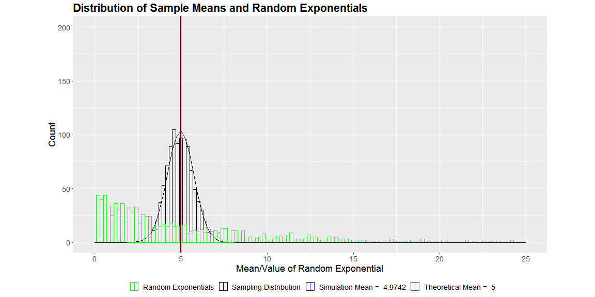
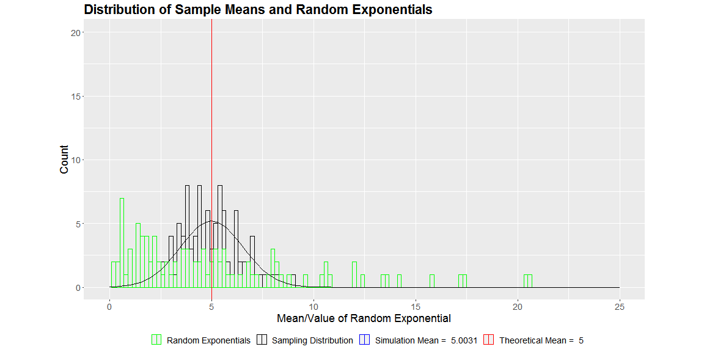

Pitchdeck for Play with Central Limit Theorem App
========================================================
author: Aman Jindal
date: 03 September 2020
autosize: TRUE

Introduction:
========================================================

- The goal of this presentation is to visualize the application of Central Limit Theorem. Central Limit Theorem is one of the most powerful concepts in Statistics and several statistical techniques rely on it.
- Central Limit Theorem states that *"the sampling distribution of the mean of any independent, random variable will be normal or nearly normal, if the sample size is large enough"*
- In the [Play_with_CLT App](https://hbk91.shinyapps.io/Play_with_CLT), we have shown the application of Central Limit Theorem for an [Exponential Distribution](https://en.wikipedia.org/wiki/Exponential_distribution). Users can play around with *'number of simulations'*, *'sample size'* and *'mean of the exponential distribution'* to see the application of central limit theorem.

Visualizing the CLT(1/2):
========================================================

Large sample size (40) and Small number of simulations (1000) result in a more normal sample means distribution. 

Visualizing the CLT(2/2):
========================================================

Small sample size (10) and Small number of simulations (100) result in a less normal sample means distribution.  

Links to Source Code and App:
========================================================

##### - Check out the [Play_with_CLT App](https://hbk91.shinyapps.io/Play_with_CLT) for playing around with different parameters.
##### - Check out the [code for the Play_with_CLT App](https://github.com/hbk91/JHU_Coursera_Course9_Project/tree/master/Play_with_CLT)
##### - Check out the [code for this presentation](https://github.com/hbk91/JHU_Coursera_Course9_Project/blob/master/Play_with_CLT_PitchDeck.Rpres)
   
# 
 <b> Thanks </b>

